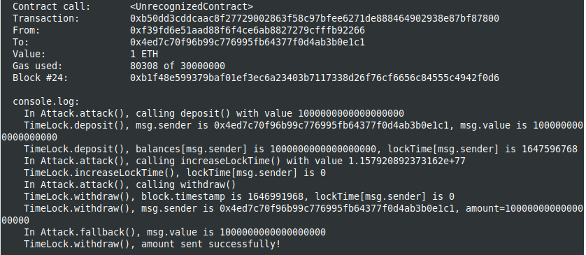

Study case of Overflow hack, from Solidity by example site [Solidity by Example, overflow](https://solidity-by-example.org/hacks/overflow/)

I use brownie to compile and deploy into hardhat in order to have the console.log feature.
You should start the hardhat node in another terminal and folder (`hh node`), then, in a terminal :

```
brownie compile
brownie run scripts/deploy.py
```

The result in the hardhat console :



As we see, if compiled with pragma solidity ^0.7.6, the overflow is effective and the check in TimeLock.withdraw() is bypassed.

If compiled with 0.8.12, an error is thrown at execution time :

```
VirtualMachineError: Transaction reverted without a reason string: Integer overflow
```

So, for contracts compiled with compiler inferior to 0.8, one should use the [OpenZeppelin SafeMath lib] (https://github.com/OpenZeppelin/openzeppelin-contracts/blob/master/contracts/math/SafeMath.sol) for performing arithmetic operations.
